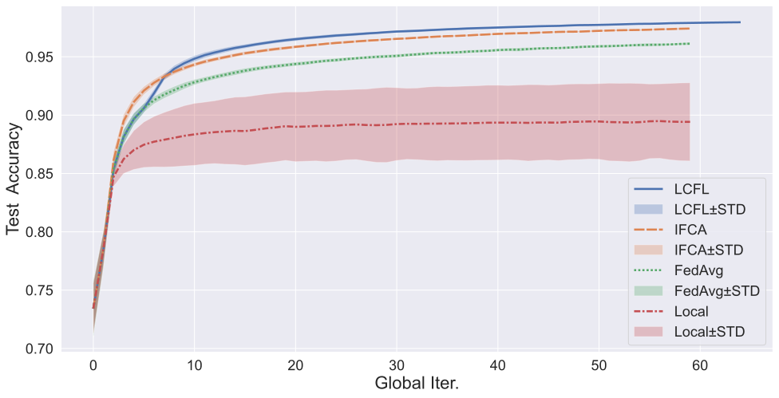

# Novel clustered federated learning based on local loss (LCFL)

## Introduction

This is the code for the paper [Novel clustered federated learning based on local loss] (to add link).

The code is based on a simulation framework for federated learning [fl-sim](https://github.com/wenh06/fl-sim).

## Requirements

To install requirements:

```bash
pip install -r requirements.txt
```

## Usage

One can use the code in a Jupyter notebook or in command line as follows:

```bash
fl-sim configs/lcfl-rot-mnist.yml
```

or run in background using:

```bash
mkdir -p .logs
nohup fl-sim configs/lcfl-rot-mnist.yml > .logs/lcfl-rot-mnist.log 2>&1 & echo $! > .logs/lcfl-rot-mnist.pid
```

## Inspection of the results

One can use the `Panel` widget to inspect the results in a Jupyter notebook:

```python
%load_ext autoreload
%autoreload 2

from fl_sim.utils.viz import Panel

panel = Panel()
```

## Results

**ALL** experiments were repeated 5 times with different random seeds.

### Experiments on the RotatedMNIST dataset

 1200 clients - ACC           |  1200 clients - loss
:----------------------------:|:-----------------------------:
 | 
 2400 clients - ACC           |  2400 clients - loss
 | 

### Experiments on the RotatedCIFAR10 dataset

 dynamic transforms - ACC     | dynamic transforms - loss
:----------------------------:|:-----------------------------:
 | 
 no transforms - ACC          |  no transforms - loss
 | 

### v.s. other norms

FEMNIST                |  RotatedMNIST
:---------------------:|:---------------------:
 | 
